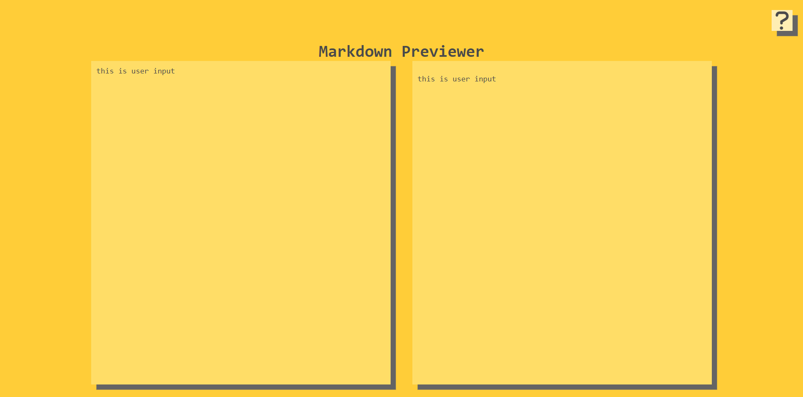
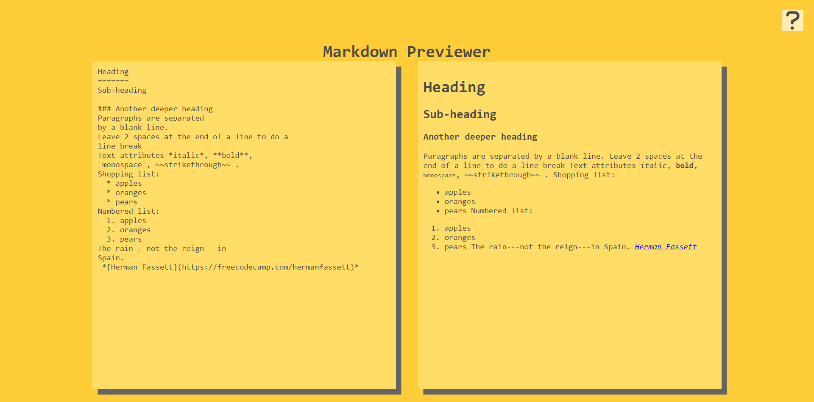

# React-MarkdownPreviewerApp

* Patika.dev Redux modülü "Markdown Previewer" çalışması.

## Kurulum
1. Depoyu klonlayın ve bağlılıklarını kurun.
```
npm install or yarn install
```

2. Projeyi yerel olarak (localhost) başlatın.
```
npm start or yarn start
```

## Kullanımı
* Ekranın sol kısmında gireceginiz markdown formatındaki veriler, ekranın sağ tarafında ön izleme şeklinde gözükmektedir.
* Ekranın sağ üst köşesindeki soru işareti butonuna basıldığında örnek bir markdown ve ön izlemesi görüntülenmektedir.


## Kullanılan Teknoloji ve Araçlar
* React.js
* Redux
* Redux Toolkit
* React Markdown
* React Syntax Highlighter


## Demo
[https://ismailkaraalioglu-markdownpreviewer.netlify.app/](https://ismailkaraalioglu-markdownpreviewer.netlify.app/)


